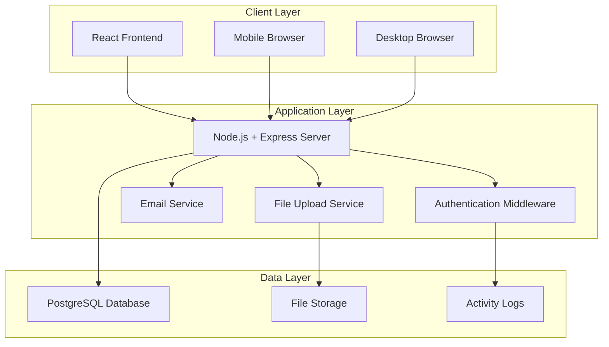
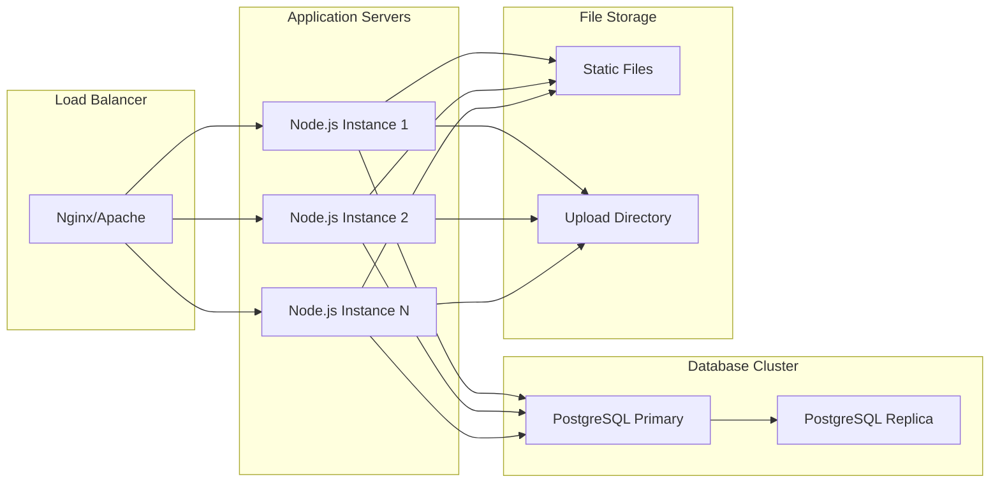

# Design Document: Smart Event Registration and Auto-Communication System

## Overview

The Smart Event Registration and Auto-Communication System is a comprehensive web-based platform designed for colleges and universities to manage event lifecycle from creation to completion. The system implements a three-tier architecture with React frontend, Node.js/Express backend, and PostgreSQL database, providing role-based access control for Students, Organizers, Faculty, and Admins.

The system features automated email communications, dual verification workflows, payment processing with QR code integration, comprehensive reporting, and real-time dashboards. It emphasizes security, scalability, and user experience while maintaining data integrity and system reliability.

## Architecture

### System Architecture Overview

The system follows a three-tier architecture pattern:



### Technology Stack

- **Frontend**: React (JavaScript) with responsive design
- **Backend**: Node.js with Express framework
- **Database**: PostgreSQL with raw SQL queries
- **Database Client**: pg (node-postgres) library
- **Database Management**: pgAdmin 4
- **Authentication**: JWT tokens with secure sessions
- **Email Service**: Nodemailer with SMTP
- **File Storage**: Local file system with organized directory structure
- **Security**: bcrypt for password hashing, helmet for security headers

### Deployment Architecture



## Components and Interfaces

### Frontend Components

#### Core Component Structure

```javascript
// App.js - Main application component
const App = () => {
  return (
    <Router>
      <AuthProvider>
        <NotificationProvider>
          <Routes>
            <Route path="/login" component={LoginPage} />
            <Route path="/register" component={RegisterPage} />
            <Route path="/dashboard" component={Dashboard} />
            <Route path="/events" component={EventsPage} />
            <Route path="/admin" component={AdminPanel} />
          </Routes>
        </NotificationProvider>
      </AuthProvider>
    </Router>
  );
};
```

#### Authentication Components

```javascript
// AuthProvider.js - Authentication context provider
const AuthProvider = ({ children }) => {
  const [user, setUser] = useState(null);
  const [loading, setLoading] = useState(true);
  
  const login = async (email, password) => {
    // JWT authentication logic
  };
  
  const logout = () => {
    // Clear tokens and user state
  };
  
  return (
    <AuthContext.Provider value={{ user, login, logout, loading }}>
      {children}
    </AuthContext.Provider>
  );
};

// ProtectedRoute.js - Route protection component
const ProtectedRoute = ({ component: Component, roles, ...rest }) => {
  const { user } = useAuth();
  
  return (
    <Route
      {...rest}
      render={(props) =>
        user && roles.includes(user.role) ? (
          <Component {...props} />
        ) : (
          <Redirect to="/login" />
        )
      }
    />
  );
};
```

#### Dashboard Components

```javascript
// StudentDashboard.js
const StudentDashboard = () => {
  const [events, setEvents] = useState([]);
  const [registrations, setRegistrations] = useState([]);
  
  return (
    <div className="dashboard">
      <EventsList events={events} />
      <MyRegistrations registrations={registrations} />
      <EventFilters onFilter={handleFilter} />
    </div>
  );
};

// OrganizerDashboard.js
const OrganizerDashboard = () => {
  const [myEvents, setMyEvents] = useState([]);
  const [participants, setParticipants] = useState([]);
  
  return (
    <div className="dashboard">
      <EventCreationForm onSubmit={handleEventCreate} />
      <MyEventsList events={myEvents} />
      <ParticipantManagement participants={participants} />
    </div>
  );
};

// FacultyDashboard.js
const FacultyDashboard = () => {
  const [pendingEvents, setPendingEvents] = useState([]);
  const [reports, setReports] = useState([]);
  
  return (
    <div className="dashboard">
      <EventApprovalQueue events={pendingEvents} />
      <ReportsSection reports={reports} />
      <AnalyticsDashboard />
    </div>
  );
};
```

#### Event Management Components

```javascript
// EventCard.js - Reusable event display component
const EventCard = ({ event, userRole, onRegister, onApprove, onReject }) => {
  return (
    <div className="event-card">
      <EventHeader event={event} />
      <EventDetails event={event} />
      <EventActions 
        event={event} 
        userRole={userRole}
        onRegister={onRegister}
        onApprove={onApprove}
        onReject={onReject}
      />
    </div>
  );
};

// EventForm.js - Event creation/editing form
const EventForm = ({ event, onSubmit, onCancel }) => {
  const [formData, setFormData] = useState(event || {});
  const [paymentQR, setPaymentQR] = useState(null);
  
  return (
    <form onSubmit={handleSubmit}>
      <EventBasicInfo data={formData} onChange={setFormData} />
      <PaymentSettings data={formData} onChange={setFormData} />
      <QRCodeUpload file={paymentQR} onChange={setPaymentQR} />
      <FormActions onSubmit={handleSubmit} onCancel={onCancel} />
    </form>
  );
};
```

### Backend API Structure

#### Server Configuration

```javascript
// server.js - Main server setup
const express = require('express');
const cors = require('cors');
const helmet = require('helmet');
const rateLimit = require('express-rate-limit');

const app = express();

// Security middleware
app.use(helmet());
app.use(cors({
  origin: process.env.FRONTEND_URL,
  credentials: true
}));

// Rate limiting
const limiter = rateLimit({
  windowMs: 15 * 60 * 1000, // 15 minutes
  max: 100 // limit each IP to 100 requests per windowMs
});
app.use('/api/', limiter);

// Body parsing
app.use(express.json({ limit: '10mb' }));
app.use(express.urlencoded({ extended: true }));

// Routes
app.use('/api/auth', authRoutes);
app.use('/api/events', eventRoutes);
app.use('/api/users', userRoutes);
app.use('/api/admin', adminRoutes);
app.use('/api/reports', reportRoutes);

// Error handling middleware
app.use(errorHandler);

const PORT = process.env.PORT || 3000;
app.listen(PORT, () => {
  console.log(`Server running on port ${PORT}`);
});
```

#### Authentication Middleware

```javascript
// middleware/auth.js
const jwt = require('jsonwebtoken');
const { Pool } = require('pg');

const authenticateToken = async (req, res, next) => {
  const authHeader = req.headers['authorization'];
  const token = authHeader && authHeader.split(' ')[1];
  
  if (!token) {
    return res.status(401).json({ error: 'Access token required' });
  }
  
  try {
    const decoded = jwt.verify(token, process.env.JWT_SECRET);
    const user = await getUserById(decoded.userId);
    req.user = user;
    next();
  } catch (error) {
    return res.status(403).json({ error: 'Invalid token' });
  }
};

const authorizeRoles = (...roles) => {
  return (req, res, next) => {
    if (!req.user || !roles.includes(req.user.role)) {
      return res.status(403).json({ error: 'Insufficient permissions' });
    }
    next();
  };
};
```

#### API Route Handlers

```javascript
// routes/events.js
const express = require('express');
const router = express.Router();
const eventController = require('../controllers/eventController');
const { authenticateToken, authorizeRoles } = require('../middleware/auth');

// Public routes
router.get('/approved', eventController.getApprovedEvents);

// Student routes
router.post('/register', authenticateToken, eventController.registerForEvent);
router.delete('/register/:eventId', authenticateToken, eventController.cancelRegistration);

// Organizer routes
router.post('/', authenticateToken, authorizeRoles('organizer'), eventController.createEvent);
router.put('/:id', authenticateToken, authorizeRoles('organizer'), eventController.updateEvent);
router.delete('/:id', authenticateToken, authorizeRoles('organizer'), eventController.deleteEvent);
router.get('/my-events', authenticateToken, authorizeRoles('organizer'), eventController.getOrganizerEvents);

// Faculty routes
router.get('/pending', authenticateToken, authorizeRoles('faculty'), eventController.getPendingEvents);
router.post('/:id/approve', authenticateToken, authorizeRoles('faculty'), eventController.approveEvent);
router.post('/:id/reject', authenticateToken, authorizeRoles('faculty'), eventController.rejectEvent);

module.exports = router;
```

#### Database Connection Pool

```javascript
// config/database.js
const { Pool } = require('pg');

const pool = new Pool({
  user: process.env.DB_USER,
  host: process.env.DB_HOST,
  database: process.env.DB_NAME,
  password: process.env.DB_PASSWORD,
  port: process.env.DB_PORT,
  max: 20, // maximum number of clients in the pool
  idleTimeoutMillis: 30000, // close idle clients after 30 seconds
  connectionTimeoutMillis: 2000, // return error after 2 seconds if connection could not be established
});

// Database query helper
const query = async (text, params) => {
  const start = Date.now();
  try {
    const res = await pool.query(text, params);
    const duration = Date.now() - start;
    console.log('Executed query', { text, duration, rows: res.rowCount });
    return res;
  } catch (error) {
    console.error('Database query error:', error);
    throw error;
  }
};

module.exports = { pool, query };
```

## Data Models

### Database Schema Design

#### Users Table

```sql
CREATE TABLE users (
    id SERIAL PRIMARY KEY,
    email VARCHAR(255) UNIQUE NOT NULL,
    password_hash VARCHAR(255) NOT NULL,
    name VARCHAR(255) NOT NULL,
    branch VARCHAR(100),
    year INTEGER,
    section VARCHAR(10),
    role VARCHAR(50) NOT NULL DEFAULT 'student',
    is_verified BOOLEAN DEFAULT FALSE,
    is_blocked BOOLEAN DEFAULT FALSE,
    created_at TIMESTAMP DEFAULT CURRENT_TIMESTAMP,
    updated_at TIMESTAMP DEFAULT CURRENT_TIMESTAMP,
    last_login TIMESTAMP,
    
    CONSTRAINT valid_role CHECK (role IN ('student', 'organizer', 'faculty', 'admin')),
    CONSTRAINT valid_year CHECK (year BETWEEN 1 AND 4),
    CONSTRAINT valid_email CHECK (email ~* '^[A-Za-z0-9._%+-]+@[A-Za-z0-9.-]+\.[A-Za-z]{2,}$')
);

-- Indexes for performance
CREATE INDEX idx_users_email ON users(email);
CREATE INDEX idx_users_role ON users(role);
CREATE INDEX idx_users_verified ON users(is_verified);
```

#### Clubs Table

```sql
CREATE TABLE clubs (
    id SERIAL PRIMARY KEY,
    name VARCHAR(255) NOT NULL,
    description TEXT,
    faculty_advisor_id INTEGER REFERENCES users(id),
    is_active BOOLEAN DEFAULT TRUE,
    created_at TIMESTAMP DEFAULT CURRENT_TIMESTAMP,
    updated_at TIMESTAMP DEFAULT CURRENT_TIMESTAMP
);

CREATE INDEX idx_clubs_active ON clubs(is_active);
```

#### Events Table

```sql
CREATE TABLE events (
    id SERIAL PRIMARY KEY,
    title VARCHAR(255) NOT NULL,
    description TEXT NOT NULL,
    organizer_id INTEGER NOT NULL REFERENCES users(id),
    club_id INTEGER REFERENCES clubs(id),
    event_date DATE NOT NULL,
    event_time TIME NOT NULL,
    location VARCHAR(255) NOT NULL,
    max_participants INTEGER,
    registration_deadline TIMESTAMP,
    status VARCHAR(50) DEFAULT 'pending',
    approval_date TIMESTAMP,
    approved_by INTEGER REFERENCES users(id),
    rejection_reason TEXT,
    is_paid_event BOOLEAN DEFAULT FALSE,
    event_fee DECIMAL(10,2) DEFAULT 0.00,
    early_bird_fee DECIMAL(10,2),
    early_bird_deadline TIMESTAMP,
    payment_qr_code VARCHAR(500), -- File path to QR code image
    created_at TIMESTAMP DEFAULT CURRENT_TIMESTAMP,
    updated_at TIMESTAMP DEFAULT CURRENT_TIMESTAMP,
    
    CONSTRAINT valid_status CHECK (status IN ('pending', 'approved', 'rejected', 'cancelled')),
    CONSTRAINT valid_fee CHECK (event_fee >= 0),
    CONSTRAINT valid_early_bird CHECK (early_bird_fee IS NULL OR early_bird_fee >= 0),
    CONSTRAINT future_event CHECK (event_date >= CURRENT_DATE)
);

-- Indexes for performance
CREATE INDEX idx_events_status ON events(status);
CREATE INDEX idx_events_organizer ON events(organizer_id);
CREATE INDEX idx_events_date ON events(event_date);
CREATE INDEX idx_events_club ON events(club_id);
```

#### Registrations Table

```sql
CREATE TABLE registrations (
    id SERIAL PRIMARY KEY,
    event_id INTEGER NOT NULL REFERENCES events(id) ON DELETE CASCADE,
    user_id INTEGER NOT NULL REFERENCES users(id),
    registration_date TIMESTAMP DEFAULT CURRENT_TIMESTAMP,
    payment_status VARCHAR(50) DEFAULT 'not_required',
    payment_amount DECIMAL(10,2),
    transaction_id VARCHAR(255),
    payment_proof VARCHAR(500), -- File path to payment proof image
    payment_verified_at TIMESTAMP,
    payment_verified_by INTEGER REFERENCES users(id),
    payment_rejection_reason TEXT,
    is_cancelled BOOLEAN DEFAULT FALSE,
    cancelled_at TIMESTAMP,
    
    UNIQUE(event_id, user_id),
    CONSTRAINT valid_payment_status CHECK (payment_status IN ('not_required', 'pending', 'verified', 'rejected', 'refunded')),
    CONSTRAINT valid_payment_amount CHECK (payment_amount IS NULL OR payment_amount >= 0)
);

-- Indexes for performance
CREATE INDEX idx_registrations_event ON registrations(event_id);
CREATE INDEX idx_registrations_user ON registrations(user_id);
CREATE INDEX idx_registrations_payment_status ON registrations(payment_status);
```

#### Email Logs Table

```sql
CREATE TABLE email_logs (
    id SERIAL PRIMARY KEY,
    recipient_email VARCHAR(255) NOT NULL,
    email_type VARCHAR(50) NOT NULL,
    subject VARCHAR(500) NOT NULL,
    body TEXT NOT NULL,
    status VARCHAR(50) DEFAULT 'pending',
    sent_at TIMESTAMP,
    error_message TEXT,
    retry_count INTEGER DEFAULT 0,
    event_id INTEGER REFERENCES events(id),
    user_id INTEGER REFERENCES users(id),
    created_at TIMESTAMP DEFAULT CURRENT_TIMESTAMP,
    
    CONSTRAINT valid_email_type CHECK (email_type IN ('verification', 'confirmation', 'reminder', 'followup', 'cancellation', 'approval', 'rejection')),
    CONSTRAINT valid_status CHECK (status IN ('pending', 'sent', 'failed', 'bounced'))
);

-- Indexes for performance
CREATE INDEX idx_email_logs_status ON email_logs(status);
CREATE INDEX idx_email_logs_type ON email_logs(email_type);
CREATE INDEX idx_email_logs_recipient ON email_logs(recipient_email);
```

#### OTP Verification Table

```sql
CREATE TABLE otp_verifications (
    id SERIAL PRIMARY KEY,
    email VARCHAR(255) NOT NULL,
    otp_code VARCHAR(6) NOT NULL,
    purpose VARCHAR(50) NOT NULL,
    expires_at TIMESTAMP NOT NULL,
    is_used BOOLEAN DEFAULT FALSE,
    created_at TIMESTAMP DEFAULT CURRENT_TIMESTAMP,
    
    CONSTRAINT valid_purpose CHECK (purpose IN ('registration', 'password_reset', 'email_change'))
);

-- Indexes for performance
CREATE INDEX idx_otp_email ON otp_verifications(email);
CREATE INDEX idx_otp_expires ON otp_verifications(expires_at);
```

#### Activity Logs Table

```sql
CREATE TABLE activity_logs (
    id SERIAL PRIMARY KEY,
    user_id INTEGER REFERENCES users(id),
    action VARCHAR(100) NOT NULL,
    resource_type VARCHAR(50),
    resource_id INTEGER,
    ip_address INET,
    user_agent TEXT,
    details JSONB,
    created_at TIMESTAMP DEFAULT CURRENT_TIMESTAMP
);

-- Indexes for performance
CREATE INDEX idx_activity_logs_user ON activity_logs(user_id);
CREATE INDEX idx_activity_logs_action ON activity_logs(action);
CREATE INDEX idx_activity_logs_created ON activity_logs(created_at);
```

#### Feedback Table

```sql
CREATE TABLE feedback (
    id SERIAL PRIMARY KEY,
    event_id INTEGER NOT NULL REFERENCES events(id),
    user_id INTEGER NOT NULL REFERENCES users(id),
    rating INTEGER NOT NULL,
    comments TEXT,
    is_anonymous BOOLEAN DEFAULT FALSE,
    created_at TIMESTAMP DEFAULT CURRENT_TIMESTAMP,
    
    UNIQUE(event_id, user_id),
    CONSTRAINT valid_rating CHECK (rating BETWEEN 1 AND 5)
);

-- Indexes for performance
CREATE INDEX idx_feedback_event ON feedback(event_id);
CREATE INDEX idx_feedback_rating ON feedback(rating);
```

### Data Access Layer

#### User Model

```javascript
// models/User.js
const { query } = require('../config/database');
const bcrypt = require('bcrypt');

class User {
  static async create(userData) {
    const { email, password, name, branch, year, section, role = 'student' } = userData;
    const passwordHash = await bcrypt.hash(password, 12);
    
    const result = await query(
      `INSERT INTO users (email, password_hash, name, branch, year, section, role)
       VALUES ($1, $2, $3, $4, $5, $6, $7)
       RETURNING id, email, name, branch, year, section, role, created_at`,
      [email, passwordHash, name, branch, year, section, role]
    );
    
    return result.rows[0];
  }
  
  static async findByEmail(email) {
    const result = await query(
      'SELECT * FROM users WHERE email = $1 AND is_blocked = FALSE',
      [email]
    );
    return result.rows[0];
  }
  
  static async findById(id) {
    const result = await query(
      'SELECT id, email, name, branch, year, section, role, is_verified, created_at FROM users WHERE id = $1',
      [id]
    );
    return result.rows[0];
  }
  
  static async verifyPassword(plainPassword, hashedPassword) {
    return await bcrypt.compare(plainPassword, hashedPassword);
  }
  
  static async updateLastLogin(userId) {
    await query(
      'UPDATE users SET last_login = CURRENT_TIMESTAMP WHERE id = $1',
      [userId]
    );
  }
}

module.exports = User;
```

#### Event Model

```javascript
// models/Event.js
const { query } = require('../config/database');

class Event {
  static async create(eventData) {
    const {
      title, description, organizer_id, club_id, event_date, event_time,
      location, max_participants, registration_deadline, is_paid_event,
      event_fee, early_bird_fee, early_bird_deadline, payment_qr_code
    } = eventData;
    
    const result = await query(
      `INSERT INTO events (
        title, description, organizer_id, club_id, event_date, event_time,
        location, max_participants, registration_deadline, is_paid_event,
        event_fee, early_bird_fee, early_bird_deadline, payment_qr_code
      ) VALUES ($1, $2, $3, $4, $5, $6, $7, $8, $9, $10, $11, $12, $13, $14)
      RETURNING *`,
      [title, description, organizer_id, club_id, event_date, event_time,
       location, max_participants, registration_deadline, is_paid_event,
       event_fee, early_bird_fee, early_bird_deadline, payment_qr_code]
    );
    
    return result.rows[0];
  }
  
  static async findApproved() {
    const result = await query(
      `SELECT e.*, u.name as organizer_name, c.name as club_name,
              COUNT(r.id) as registration_count
       FROM events e
       LEFT JOIN users u ON e.organizer_id = u.id
       LEFT JOIN clubs c ON e.club_id = c.id
       LEFT JOIN registrations r ON e.id = r.event_id AND r.is_cancelled = FALSE
       WHERE e.status = 'approved' AND e.event_date >= CURRENT_DATE
       GROUP BY e.id, u.name, c.name
       ORDER BY e.event_date ASC`
    );
    return result.rows;
  }
  
  static async findPending() {
    const result = await query(
      `SELECT e.*, u.name as organizer_name, c.name as club_name
       FROM events e
       LEFT JOIN users u ON e.organizer_id = u.id
       LEFT JOIN clubs c ON e.club_id = c.id
       WHERE e.status = 'pending'
       ORDER BY e.created_at ASC`
    );
    return result.rows;
  }
  
  static async updateStatus(eventId, status, approvedBy = null, rejectionReason = null) {
    const result = await query(
      `UPDATE events 
       SET status = $1, approved_by = $2, approval_date = CURRENT_TIMESTAMP, rejection_reason = $3
       WHERE id = $4
       RETURNING *`,
      [status, approvedBy, rejectionReason, eventId]
    );
    return result.rows[0];
  }
}

module.exports = Event;
```

#### Registration Model

```javascript
// models/Registration.js
const { query } = require('../config/database');

class Registration {
  static async create(registrationData) {
    const { event_id, user_id, payment_amount } = registrationData;
    
    // Check if already registered
    const existing = await query(
      'SELECT id FROM registrations WHERE event_id = $1 AND user_id = $2',
      [event_id, user_id]
    );
    
    if (existing.rows.length > 0) {
      throw new Error('Already registered for this event');
    }
    
    const result = await query(
      `INSERT INTO registrations (event_id, user_id, payment_amount, payment_status)
       VALUES ($1, $2, $3, $4)
       RETURNING *`,
      [event_id, user_id, payment_amount, payment_amount > 0 ? 'pending' : 'not_required']
    );
    
    return result.rows[0];
  }
  
  static async findByEvent(eventId) {
    const result = await query(
      `SELECT r.*, u.name, u.email, u.branch, u.year, u.section
       FROM registrations r
       JOIN users u ON r.user_id = u.id
       WHERE r.event_id = $1 AND r.is_cancelled = FALSE
       ORDER BY r.registration_date ASC`,
      [eventId]
    );
    return result.rows;
  }
  
  static async updatePaymentStatus(registrationId, status, verifiedBy = null, rejectionReason = null) {
    const result = await query(
      `UPDATE registrations 
       SET payment_status = $1, payment_verified_by = $2, 
           payment_verified_at = CURRENT_TIMESTAMP, payment_rejection_reason = $3
       WHERE id = $4
       RETURNING *`,
      [status, verifiedBy, rejectionReason, registrationId]
    );
    return result.rows[0];
  }
}

module.exports = Registration;
```

### Email Service Integration

```javascript
// services/emailService.js
const nodemailer = require('nodemailer');
const { query } = require('../config/database');

class EmailService {
  constructor() {
    this.transporter = nodemailer.createTransporter({
      host: process.env.SMTP_HOST,
      port: process.env.SMTP_PORT,
      secure: true,
      auth: {
        user: process.env.SMTP_USER,
        pass: process.env.SMTP_PASS
      }
    });
    
    this.retryQueue = [];
    this.processQueue();
  }
  
  async sendEmail(emailData) {
    const { to, subject, html, type, eventId, userId } = emailData;
    
    try {
      // Log email attempt
      const logResult = await query(
        `INSERT INTO email_logs (recipient_email, email_type, subject, body, event_id, user_id, status)
         VALUES ($1, $2, $3, $4, $5, $6, 'pending')
         RETURNING id`,
        [to, type, subject, html, eventId, userId]
      );
      
      const logId = logResult.rows[0].id;
      
      // Send email
      await this.transporter.sendMail({
        from: process.env.FROM_EMAIL,
        to,
        subject,
        html
      });
      
      // Update log as sent
      await query(
        'UPDATE email_logs SET status = $1, sent_at = CURRENT_TIMESTAMP WHERE id = $2',
        ['sent', logId]
      );
      
      return { success: true, logId };
      
    } catch (error) {
      // Log error and add to retry queue
      await query(
        'UPDATE email_logs SET status = $1, error_message = $2 WHERE id = $3',
        ['failed', error.message, logId]
      );
      
      this.addToRetryQueue({ ...emailData, logId, retryCount: 0 });
      return { success: false, error: error.message };
    }
  }
  
  addToRetryQueue(emailData) {
    if (emailData.retryCount < 3) {
      const delay = Math.pow(2, emailData.retryCount) * 1000; // Exponential backoff
      setTimeout(() => {
        this.retryEmail(emailData);
      }, delay);
    }
  }
  
  async retryEmail(emailData) {
    emailData.retryCount++;
    await query(
      'UPDATE email_logs SET retry_count = $1 WHERE id = $2',
      [emailData.retryCount, emailData.logId]
    );
    
    const result = await this.sendEmail(emailData);
    if (!result.success && emailData.retryCount < 3) {
      this.addToRetryQueue(emailData);
    }
  }
  
  async sendConfirmationEmail(registration, event) {
    const html = `
      <h2>Event Registration Confirmation</h2>
      <p>Dear ${registration.user_name},</p>
      <p>You have successfully registered for:</p>
      <ul>
        <li><strong>Event:</strong> ${event.title}</li>
        <li><strong>Date:</strong> ${event.event_date}</li>
        <li><strong>Time:</strong> ${event.event_time}</li>
        <li><strong>Location:</strong> ${event.location}</li>
        <li><strong>Registration ID:</strong> ${registration.id}</li>
      </ul>
      <p>Thank you for registering!</p>
    `;
    
    return await this.sendEmail({
      to: registration.user_email,
      subject: `Registration Confirmation - ${event.title}`,
      html,
      type: 'confirmation',
      eventId: event.id,
      userId: registration.user_id
    });
  }
  
  async sendReminderEmail(registration, event) {
    const html = `
      <h2>Event Reminder</h2>
      <p>Dear ${registration.user_name},</p>
      <p>This is a reminder for your upcoming event:</p>
      <ul>
        <li><strong>Event:</strong> ${event.title}</li>
        <li><strong>Date:</strong> ${event.event_date}</li>
        <li><strong>Time:</strong> ${event.event_time}</li>
        <li><strong>Location:</strong> ${event.location}</li>
      </ul>
      <p><a href="${process.env.FRONTEND_URL}/events/${event.id}/cancel">Cancel Registration</a></p>
    `;
    
    return await this.sendEmail({
      to: registration.user_email,
      subject: `Reminder - ${event.title}`,
      html,
      type: 'reminder',
      eventId: event.id,
      userId: registration.user_id
    });
  }
  
  async sendFollowUpEmail(registration, event) {
    const html = `
      <h2>Thank You for Attending</h2>
      <p>Dear ${registration.user_name},</p>
      <p>Thank you for attending ${event.title}!</p>
      <p>We hope you enjoyed the event. Your feedback is valuable to us.</p>
      <p><a href="${process.env.FRONTEND_URL}/events/${event.id}/feedback">Share Your Feedback</a></p>
    `;
    
    return await this.sendEmail({
      to: registration.user_email,
      subject: `Thank You - ${event.title}`,
      html,
      type: 'followup',
      eventId: event.id,
      userId: registration.user_id
    });
  }
}

module.exports = new EmailService();
```

### File Upload Service

```javascript
// services/fileUploadService.js
const multer = require('multer');
const path = require('path');
const fs = require('fs').promises;

// Configure multer for file uploads
const storage = multer.diskStorage({
  destination: async (req, file, cb) => {
    const uploadPath = path.join(__dirname, '../uploads', file.fieldname);
    await fs.mkdir(uploadPath, { recursive: true });
    cb(null, uploadPath);
  },
  filename: (req, file, cb) => {
    const uniqueSuffix = Date.now() + '-' + Math.round(Math.random() * 1E9);
    cb(null, file.fieldname + '-' + uniqueSuffix + path.extname(file.originalname));
  }
});

const fileFilter = (req, file, cb) => {
  // Allow images for QR codes and payment proofs
  if (file.mimetype.startsWith('image/')) {
    cb(null, true);
  } else {
    cb(new Error('Only image files are allowed'), false);
  }
};

const upload = multer({
  storage,
  fileFilter,
  limits: {
    fileSize: 5 * 1024 * 1024 // 5MB limit
  }
});

class FileUploadService {
  static getUploadMiddleware() {
    return {
      qrCode: upload.single('qrCode'),
      paymentProof: upload.single('paymentProof')
    };
  }
  
  static async deleteFile(filePath) {
    try {
      await fs.unlink(filePath);
      return true;
    } catch (error) {
      console.error('Error deleting file:', error);
      return false;
    }
  }
  
  static getFileUrl(filePath) {
    return `${process.env.BASE_URL}/uploads/${filePath}`;
  }
}

module.exports = FileUploadService;
```

## Correctness Properties

*A property is a characteristic or behavior that should hold true across all valid executions of a system—essentially, a formal statement about what the system should do. Properties serve as the bridge between human-readable specifications and machine-verifiable correctness guarantees.*

Based on the prework analysis, I have identified the following testable properties that can be validated through property-based testing. These properties ensure the system behaves correctly across all valid inputs and scenarios.

### Authentication and Authorization Properties

**Property 1: Email OTP Generation**
*For any* valid college email address, when a user registers, the system should generate and send an OTP to that email address within the specified time limit.
**Validates: Requirements 1.1**

**Property 2: OTP Validation Within Time Window**
*For any* valid OTP generated within the last 10 minutes, when a user enters it, the system should verify the email and activate the account.
**Validates: Requirements 1.2**

**Property 3: Invalid OTP Rejection**
*For any* invalid OTP (wrong code, expired, or already used), when a user enters it, the system should reject the verification and display an appropriate error message.
**Validates: Requirements 1.3, 1.4**

**Property 4: College Domain Validation**
*For any* email address, the system should only accept addresses that match the official college domain pattern for registration and OTP sending.
**Validates: Requirements 1.5, 1.7**

**Property 5: Role-Based Access Control**
*For any* user with a specific role, when they attempt to access features, the system should only grant access to features appropriate to their role and deny access to others.
**Validates: Requirements 2.1, 2.2, 2.3, 2.5**

**Property 6: Multiple Role Support**
*For any* user assigned multiple roles, the system should grant access to all features appropriate to any of their assigned roles.
**Validates: Requirements 2.4**

### Event Management Properties

**Property 7: Event Creation Validation**
*For any* event creation attempt, the system should require all mandatory fields (name, description, date, time, location, club affiliation) and reject incomplete submissions.
**Validates: Requirements 3.1**

**Property 8: Event Status Management**
*For any* event submitted by an organizer, the system should initially set the status to pending and require faculty approval before making it visible to students.
**Validates: Requirements 3.2, 4.4**

**Property 9: Event Approval Workflow**
*For any* pending event, when faculty approves it, the system should change status to approved and make it visible to all students.
**Validates: Requirements 4.2**

**Property 10: Event Rejection Workflow**
*For any* pending event, when faculty rejects it with a reason, the system should change status to rejected and notify the organizer.
**Validates: Requirements 4.3**

**Property 11: Event Edit Re-approval**
*For any* approved event that is edited by an organizer, the system should reset the approval status to pending and require re-approval.
**Validates: Requirements 4.5**

### Registration Properties

**Property 12: Student Event Visibility**
*For any* student viewing the event list, the system should display only events with approved status and hide all pending, rejected, or cancelled events.
**Validates: Requirements 5.1**

**Property 13: Registration Process**
*For any* student registering for an approved event, the system should add them to the participant list and send a confirmation email.
**Validates: Requirements 5.2**

**Property 14: Duplicate Registration Prevention**
*For any* student attempting to register for an event they are already registered for, the system should prevent the duplicate registration and notify the user.
**Validates: Requirements 5.3, 26.2**

**Property 15: Registration Cancellation**
*For any* student canceling their registration, the system should remove them from the participant list and send a cancellation confirmation email.
**Validates: Requirements 5.4**

### Email Communication Properties

**Property 16: Confirmation Email Timing**
*For any* successful event registration, the system should send a confirmation email within 1 minute containing all required event details and registration ID.
**Validates: Requirements 6.1, 6.2**

**Property 17: Email Retry Logic**
*For any* failed email delivery attempt, the system should retry up to 3 times with exponential backoff and log all attempts.
**Validates: Requirements 6.3, 14.1**

**Property 18: Official Email Sender**
*For any* automated email sent by the system, the sender address should be from the official college domain.
**Validates: Requirements 6.4**

**Property 19: Reminder Email Scheduling**
*For any* event scheduled more than 24 hours in advance, the system should send reminder emails to all registered participants exactly 24 hours before the event.
**Validates: Requirements 7.1**

**Property 20: Immediate Reminder for Near Events**
*For any* event scheduled within 24 hours, when a student registers, the system should send a reminder email immediately.
**Validates: Requirements 7.2**

**Property 21: Follow-up Email Timing**
*For any* concluded event, the system should send follow-up emails to all registered participants within 24 hours of the event end time.
**Validates: Requirements 8.1**

### Payment Processing Properties

**Property 22: Payment Display for Paid Events**
*For any* event that requires payment, when a student views registration details, the system should display the event fee, payment instructions, and QR code.
**Validates: Requirements 28.1, 28.3**

**Property 23: Payment Proof Requirement**
*For any* paid event registration, the system should require students to upload payment proof before completing registration.
**Validates: Requirements 28.4**

**Property 24: Payment Status Management**
*For any* payment proof upload, the system should mark the registration as pending verification and allow organizers to approve or reject the payment.
**Validates: Requirements 28.5, 28.7**

**Property 25: Payment Verification Workflow**
*For any* payment verification by an organizer, the system should update the registration status appropriately and send confirmation or rejection notifications.
**Validates: Requirements 28.8, 28.9**

**Property 26: Revenue Calculation**
*For any* paid event, the system should accurately calculate and display total revenue from all verified payments.
**Validates: Requirements 28.11**

### Data Validation and Security Properties

**Property 27: Input Validation**
*For any* user input submitted to the system, all data should be validated for format, length, and type requirements before storage.
**Validates: Requirements 26.1, 26.4**

**Property 28: Password Security**
*For any* user password stored in the system, it should be encrypted using industry-standard hashing algorithms and never stored in plain text.
**Validates: Requirements 13.1**

**Property 29: Authorization Verification**
*For any* attempt to access user data, the system should verify proper authorization before granting access.
**Validates: Requirements 13.3**

**Property 30: Activity Logging**
*For any* user action (login, logout, event creation, registration, administrative action), the system should create an entry in the activity log with timestamp and details.
**Validates: Requirements 13.4, 20.1**

**Property 31: Database Transaction Atomicity**
*For any* database operation involving multiple related changes, the system should ensure all changes succeed together or all fail together (ACID properties).
**Validates: Requirements 22.5, 26.6**

### System Configuration Properties

**Property 32: Technology Stack Compliance**
*For any* system component, it should be implemented using the specified technology stack: React frontend, Node.js/Express backend, PostgreSQL database with pg library.
**Validates: Requirements 27.1, 27.2, 27.3, 27.4, 27.5**

**Property 33: Database Connection Pooling**
*For any* database connection request, the system should use connection pooling to efficiently manage database connections.
**Validates: Requirements 15.4**

**Property 34: Cross-Platform Compatibility**
*For any* supported browser (Chrome, Firefox, Safari, Edge) and device type, the system should maintain full functionality without requiring additional software.
**Validates: Requirements 25.1, 25.3, 25.4**

**Property 35: Responsive Design**
*For any* screen size (mobile, tablet, desktop), the system should provide a responsive design that adapts appropriately.
**Validates: Requirements 23.1**

### Administrative Properties

**Property 36: Admin Panel Access**
*For any* admin user accessing the control panel, the system should display user management, club management, and activity monitoring sections.
**Validates: Requirements 18.1**

**Property 37: Account Blocking Functionality**
*For any* account blocked by an admin, the system should prevent login and send a notification email to the user with the blocking reason.
**Validates: Requirements 18.3, 18.7**

**Property 38: Report Generation**
*For any* report request by faculty or organizers, the system should generate accurate reports containing all requested participant information in the specified format (Excel or PDF).
**Validates: Requirements 19.1, 19.2, 19.3, 19.4**

**Property 39: Feedback System Integration**
*For any* concluded event where feedback is enabled, the system should send feedback survey links to participants and prevent duplicate feedback submissions.
**Validates: Requirements 17.1, 17.5**

## Error Handling

### Error Categories and Responses

#### Authentication Errors
- **Invalid Credentials**: Return 401 with clear error message
- **Expired Token**: Return 401 and redirect to login
- **Insufficient Permissions**: Return 403 with role-specific message
- **Account Blocked**: Return 403 with contact information

#### Validation Errors
- **Missing Required Fields**: Return 400 with field-specific messages
- **Invalid Format**: Return 400 with format requirements
- **Constraint Violations**: Return 409 with conflict details
- **File Upload Errors**: Return 413 for size limits, 415 for type restrictions

#### Business Logic Errors
- **Duplicate Registration**: Return 409 with existing registration details
- **Event Not Found**: Return 404 with suggestion to refresh
- **Registration Closed**: Return 410 with event details
- **Payment Required**: Return 402 with payment instructions

#### System Errors
- **Database Connection**: Return 503 with retry suggestion
- **Email Service Down**: Return 503 but continue with registration
- **File System Errors**: Return 500 with fallback options
- **External Service Failures**: Return 502 with alternative methods

### Error Handling Implementation

```javascript
// middleware/errorHandler.js
const errorHandler = (err, req, res, next) => {
  console.error('Error:', err);
  
  // Log error to activity log
  logActivity(req.user?.id, 'error', 'system', null, {
    error: err.message,
    stack: err.stack,
    url: req.url,
    method: req.method
  });
  
  // Handle specific error types
  if (err.name === 'ValidationError') {
    return res.status(400).json({
      error: 'Validation failed',
      details: err.details
    });
  }
  
  if (err.name === 'UnauthorizedError') {
    return res.status(401).json({
      error: 'Authentication required',
      message: 'Please log in to continue'
    });
  }
  
  if (err.code === '23505') { // PostgreSQL unique violation
    return res.status(409).json({
      error: 'Duplicate entry',
      message: 'This record already exists'
    });
  }
  
  // Default error response
  res.status(500).json({
    error: 'Internal server error',
    message: 'Something went wrong. Please try again later.'
  });
};

module.exports = errorHandler;
```

### Client-Side Error Handling

```javascript
// utils/errorHandler.js
export const handleApiError = (error) => {
  if (error.response) {
    const { status, data } = error.response;
    
    switch (status) {
      case 400:
        return {
          type: 'validation',
          message: data.message || 'Please check your input',
          details: data.details
        };
      case 401:
        return {
          type: 'auth',
          message: 'Please log in to continue',
          action: 'redirect_login'
        };
      case 403:
        return {
          type: 'permission',
          message: 'You do not have permission for this action'
        };
      case 409:
        return {
          type: 'conflict',
          message: data.message || 'This action conflicts with existing data'
        };
      case 500:
        return {
          type: 'server',
          message: 'Server error. Please try again later.'
        };
      default:
        return {
          type: 'unknown',
          message: 'An unexpected error occurred'
        };
    }
  }
  
  return {
    type: 'network',
    message: 'Network error. Please check your connection.'
  };
};
```

## Testing Strategy

### Dual Testing Approach

The system will implement a comprehensive testing strategy combining both unit tests and property-based tests to ensure correctness and reliability:

**Unit Tests**: Focus on specific examples, edge cases, and error conditions
- Test specific user scenarios and workflows
- Validate error handling and edge cases
- Test integration points between components
- Verify specific business rules and constraints

**Property-Based Tests**: Verify universal properties across all inputs
- Test system behavior with randomly generated valid inputs
- Ensure properties hold for all possible data combinations
- Validate system invariants and consistency rules
- Comprehensive input coverage through randomization

Together, these approaches provide comprehensive coverage where unit tests catch concrete bugs and property tests verify general correctness.

### Property-Based Testing Configuration

**Testing Library**: Use `fast-check` for JavaScript property-based testing
**Test Configuration**: Minimum 100 iterations per property test
**Test Tagging**: Each property test must reference its design document property

Example property test structure:
```javascript
// tests/properties/authentication.test.js
const fc = require('fast-check');

describe('Authentication Properties', () => {
  test('Property 1: Email OTP Generation', () => {
    // Feature: smart-event-registration-system, Property 1: Email OTP Generation
    fc.assert(fc.property(
      fc.emailAddress({ domain: 'college.edu' }),
      async (email) => {
        const result = await registerUser({ email, ...validUserData });
        expect(result.otpSent).toBe(true);
        expect(result.otpEmail).toBe(email);
      }
    ), { numRuns: 100 });
  });
  
  test('Property 5: Role-Based Access Control', () => {
    // Feature: smart-event-registration-system, Property 5: Role-Based Access Control
    fc.assert(fc.property(
      fc.constantFrom('student', 'organizer', 'faculty', 'admin'),
      fc.constantFrom('create_event', 'approve_event', 'view_admin_panel'),
      async (userRole, action) => {
        const user = await createUserWithRole(userRole);
        const hasAccess = await checkAccess(user, action);
        const shouldHaveAccess = getRolePermissions(userRole).includes(action);
        expect(hasAccess).toBe(shouldHaveAccess);
      }
    ), { numRuns: 100 });
  });
});
```

### Unit Testing Strategy

**Testing Framework**: Jest for JavaScript testing
**Coverage Target**: Minimum 80% code coverage
**Test Categories**:
- Component tests for React components
- API endpoint tests for Express routes
- Database model tests for data operations
- Service integration tests for email and file upload

Example unit test structure:
```javascript
// tests/unit/eventController.test.js
describe('Event Controller', () => {
  test('should create event with valid data', async () => {
    const eventData = {
      title: 'Test Event',
      description: 'Test Description',
      event_date: '2024-12-25',
      event_time: '10:00:00',
      location: 'Test Location',
      organizer_id: 1,
      club_id: 1
    };
    
    const result = await eventController.createEvent(eventData);
    expect(result.status).toBe('pending');
    expect(result.title).toBe(eventData.title);
  });
  
  test('should reject event creation with missing required fields', async () => {
    const incompleteData = { title: 'Test Event' };
    
    await expect(eventController.createEvent(incompleteData))
      .rejects.toThrow('Missing required fields');
  });
});
```

### Integration Testing

**Database Testing**: Use test database with transaction rollback
**Email Testing**: Mock email service for testing
**File Upload Testing**: Use temporary directories for test files
**API Testing**: Test complete request/response cycles

### Performance Testing

**Load Testing**: Simulate concurrent users and measure response times
**Database Performance**: Test query performance with large datasets
**Email Queue Testing**: Test email system under high volume
**File Upload Testing**: Test file handling with various sizes and types

The testing strategy ensures that both individual components work correctly (unit tests) and that the system as a whole maintains its correctness properties under all conditions (property-based tests).